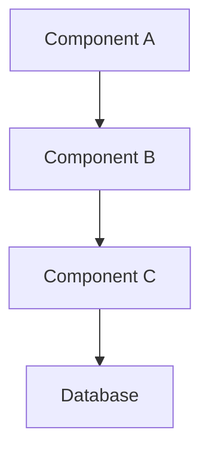
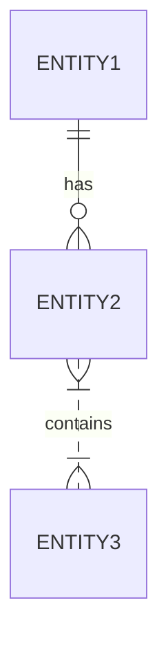

# [Design Document Title]

## Overview
[Brief description of the design and its purpose]

## Background
[Context and background information about why this design is needed]

## Goals and Non-Goals
### Goals
- [Goal 1]
- [Goal 2]
- [Goal 3]

### Non-Goals
- [Non-goal 1]
- [Non-goal 2]

## System Design
### High-Level Design
[High-level description of the system design]

### Components
#### Component A
- Purpose:
- Responsibilities:
- Interfaces:
- Dependencies:

#### Component B
- Purpose:
- Responsibilities:
- Interfaces:
- Dependencies:

### Data Model

### APIs and Interfaces
[Description of APIs and interfaces]

### Security Considerations
- Authentication
- Authorization
- Data Protection
- Security Risks and Mitigations

## Implementation Plan
### Phase 1
- [Task 1]
- [Task 2]
- [Task 3]

### Phase 2
- [Task 1]
- [Task 2]
- [Task 3]

## Testing Strategy
### Unit Testing
[Description of unit testing approach]

### Integration Testing
[Description of integration testing approach]

### Performance Testing
[Description of performance testing approach]

## Monitoring and Alerting
### Metrics
- [Metric 1]
- [Metric 2]
- [Metric 3]

### Alerts
- [Alert 1]
- [Alert 2]
- [Alert 3]

## Rollout Plan
1. [Step 1]
2. [Step 2]
3. [Step 3]

## Risks and Mitigations
| Risk | Impact | Likelihood | Mitigation |
|------|---------|------------|------------|
| [Risk 1] | High/Med/Low | High/Med/Low | [Mitigation strategy] |
| [Risk 2] | High/Med/Low | High/Med/Low | [Mitigation strategy] |

## Alternative Approaches Considered
### Alternative 1
- Pros:
- Cons:
- Why not chosen:

### Alternative 2
- Pros:
- Cons:
- Why not chosen:

## References
- [Reference 1]
- [Reference 2]
- [Reference 3]

## Appendix
### A. Performance Analysis
[Performance analysis details]

### B. Security Analysis
[Security analysis details]

### C. Cost Analysis
[Cost analysis details] 